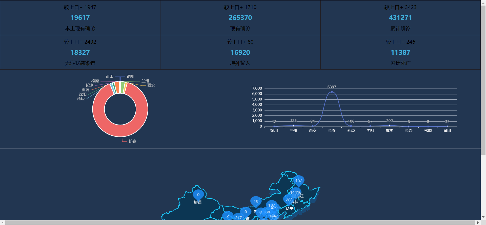
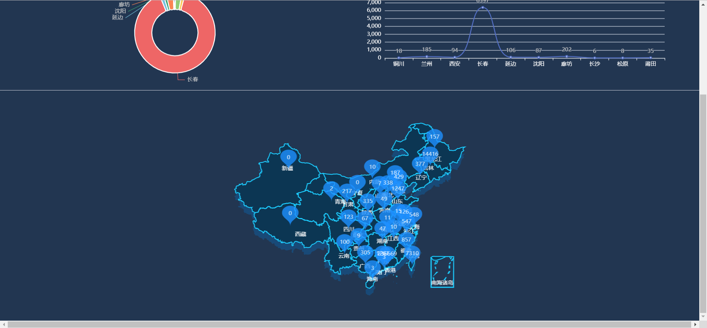

# 新冠疫情可视化

<table>
    <tr>
        <td>
            
        </td>
		<td>
            
        </td>
    </tr>
</table>

ʕ•̫͡•ʔ-̫͡-ʕ•͓͡•ʕ•̫͡•ʔ-̫͡-ʕ•͓͡•ʔ-̫͡-ʔ

## 🔧技术栈

前端：Vue3 + Vite + TypeScript + Pinia +ElementUI

后端：Express + 云函数

## 🐳数据来源

[https://api.inews.qq.com/newsqa/v1/query/inner/publish/modules/list?modules=statisGradeCityDetail,diseaseh5Shelf](https://api.inews.qq.com/newsqa/v1/query/inner/publish/modules/list?modules=statisGradeCityDetail,diseaseh5Shelf)

## 🤝 欢迎贡献

对于一些 Bug 修复和细节优化，欢迎直接提交 PR 🌹

## 🔗参考资料

[https://github.com/message163/xiaoman_novid19](https://github.com/message163/xiaoman_novid19)

[https://element-plus.gitee.io/zh-CN/](https://element-plus.gitee.io/zh-CN/)

